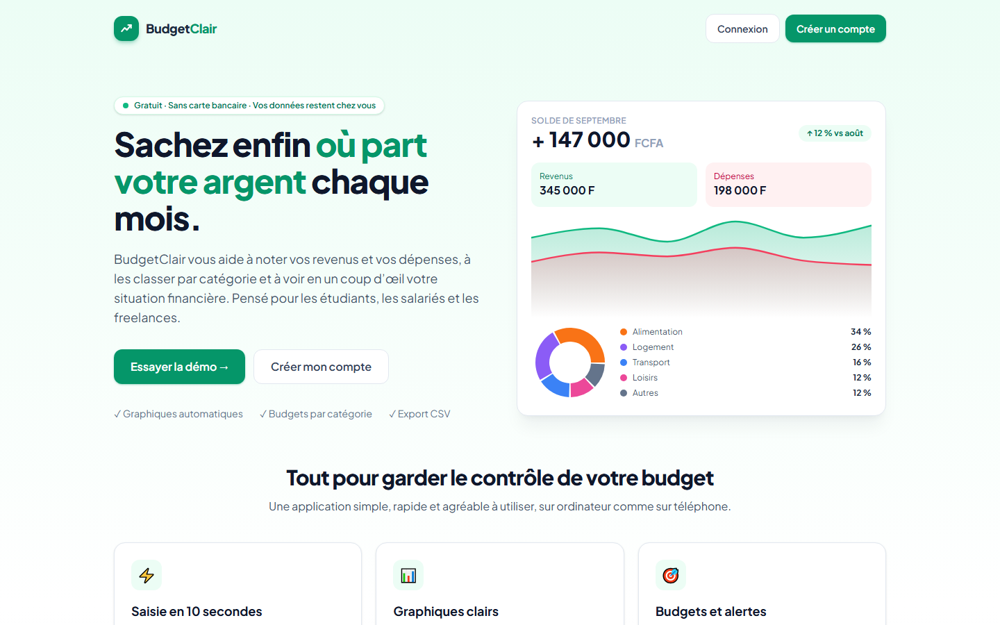
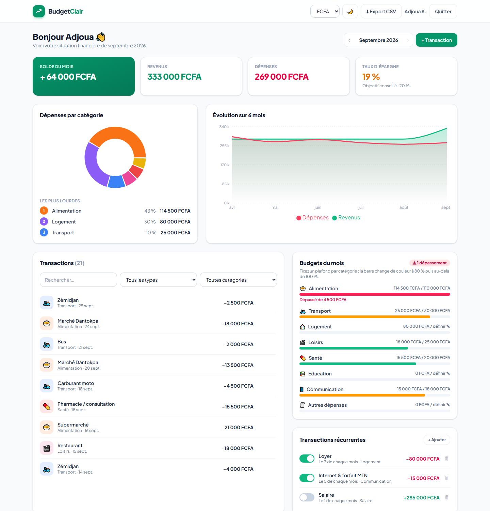

# BudgetClair — Suivi de dépenses personnelles

Application web pour enregistrer ses revenus et ses dépenses, les classer par catégorie et visualiser sa
situation financière mensuelle avec des graphiques. Projet n°1 du cahier des charges « 9 projets fictifs ».

**Démo en ligne :** https://budgetclair-nine.vercel.app (bouton « Essayer la démo », compte prérempli sur 6 mois)




## Fonctionnalités (MVP)

- Authentification (inscription / connexion par e-mail et mot de passe)
- Ajout, modification et suppression de transactions (revenu ou dépense)
- Catégories : Alimentation, Transport, Logement, Loisirs, Santé, Éducation, Communication, etc.
- Tableau de bord : solde du mois, revenus, dépenses, taux d’épargne, dernières transactions
- Graphique en camembert par catégorie et courbe d’évolution sur 6 mois
- Export des transactions au format CSV (compatible Excel, encodage UTF-8)

## Fonctionnalités avancées (bonus)

- Budgets mensuels par catégorie avec alerte visuelle (orange dès 80 %, rouge en cas de dépassement)
- Multi-devises FCFA / EUR / USD (1 EUR = 655,957 FCFA ; taux USD indicatif)
- Transactions récurrentes (loyer, abonnements, salaire) générées automatiquement chaque mois
- Mode sombre / clair, recherche et filtres, interface adaptée mobile

## Installer l’application (PWA)

L’application est installable sur **Android, iPhone/iPad, Windows, Mac et Linux** : icône sur l’écran
d’accueil, ouverture en plein écran, utilisation hors connexion après la première visite.
Page d’aide avec QR code : `/installer` (bouton « Installer » sur l’accueil).

- Android / ordinateur (Chrome, Edge) : bouton « Installer » ou icône ⊕ de la barre d’adresse
- iPhone / iPad (Safari) : Partager → « Sur l’écran d’accueil »

Technique : `manifest.webmanifest`, icônes (dont icône « maskable »), service worker (`public/sw.js`).

## Stack

| Composant | Technologie |
|---|---|
| Frontend | React 19 + Vite + Tailwind CSS 4 |
| Graphiques | Recharts |
| Gestion d’état | Context API |
| Persistance | LocalStorage (v1) — un back-end PHP/MySQL est prévu pour la v2 |

Modèle de données : `users (id, nom, email, mot_de_passe)`, `categories (id, nom, type)`,
`transactions (id, user_id, categorie_id, montant, date, description)`.

> Version démo : les comptes et les données sont enregistrés dans le navigateur, les mots de passe sont
> hachés (SHA-256). Elle n’est pas destinée à conserver de vraies données financières.

## Lancer le projet

```bash
npm install
npm run dev      # http://localhost:5173
npm run build
```

Auteur : [Sedjame Vianney](https://sedjame-vianney.vercel.app)
